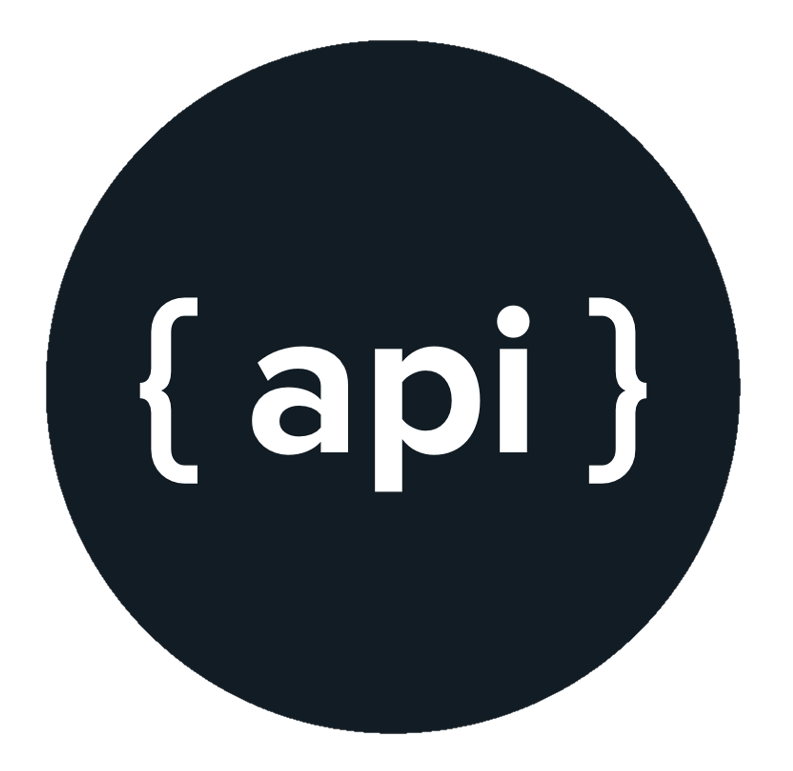

<!--
  Created by: Ethan Baker (contact@ethanbaker.dev)
  
  Adapted from:
    https://github.com/othneildrew/Best-README-Template/

Here are different preset "variables" that you can search and replace in this template.
`path_to_logo`
`path_to_demo`
-->
<div id="top"></div>


<!-- PROJECT SHIELDS/BUTTONS -->
<!-- 
NEED GITHUB WORKFLOW [](https://raw.githack.com/wiki/USER/REPO/coverage.html)
-->

[](https://godoc.org/github.com/ethanbaker/api)
[](https://goreportcard.com/report/github.com/ethanbaker/api)
[![Contributors][contributors-shield]][contributors-url]
[![Forks][forks-shield]][forks-url]
[![Stargazers][stars-shield]][stars-url]
[![Issues][issues-shield]][issues-url]
[![License][license-shield]][license-url]
[![LinkedIn][linkedin-shield]][linkedin-url]

<!-- PROJECT LOGO -->
<br><br><br>
<div align="center">
  <a href="https://github.com/ethanbaker/api">
    
  </a>

  <h3 align="center">Go-API Template</h3>

  <p align="center">
    A modular implementation of a golang API with Gin
  </p>
</div>


<!-- TABLE OF CONTENTS -->
<details>
  <summary>Table of Contents</summary>
  <ol>
    <li>
      <a href="#about-the-project">About</a>
      <ul>
        <li><a href="#built-with">Built With</a></li>
      </ul>
    </li>
    <li>
      <a href="#getting-started">Getting Started</a>
      <ul>
        <li><a href="#prerequisites">Prerequisites</a></li>
        <li><a href="#installation">Installation</a></li>
      </ul>
    </li>
    <li><a href="#usage">Usage</a></li>
    <li><a href="#roadmap">Roadmap</a></li>
    <li><a href="#contributing">Contributing</a></li>
    <li><a href="#license">License</a></li>
    <li><a href="#contact">Contact</a></li>
  </ol>
</details>


<!-- ABOUT -->
## About

This project provides a well-structured API using Go and the Gin framework. It
includes authentication, key-based validation, and user management features. Inside
the `pkg` directory, there are numerous external packages you can use in your custom
APIs. In addition, you can clone and modify these packages as needed.

The idea of this project is to serve multiple different API functionalities (dubbed modules)
from the same instance (or URL if you're self hosting). Each module should be *its own use case* 
and shouldn't require direct overlap with other modules. For example, you *should* separate
a personal budget API schema into one module and a netflix movie catalog API schema into a
different module. You should *not* separate related functionality, such as transactions and
invoice endpoints for one project, as they probably use common types (`Transaction`, `Invoice`, etc).

The general implementation follows a modular architecture in the `template` directory:

* **internal**: Handle shared functionality between modules. For example, if you are running an API
to serve multiple customer sites, you'll probably need different modules for each site's
specifications. But, if all sites implement a chat-bot feature, you could create one common package
in the `internal` directory to house this

* **modules**: Custom-defined API modules, all being served from the same API.
Modify these as you desire according to the Gin framework!

* **docs**: Contain documentation (markdown files, word files, images, etc) for your API

* **main.go**: Set global configuration settings and run your API!

<p align="right">(<a href="#top">back to top</a>)</p>


### Built With

* [Golang](https://go.dev/)
* [Gin](https://gin-gonic.com/)
* [JWT Authentication](https://jwt.io/)

<p align="right">(<a href="#top">back to top</a>)</p>


<!-- GETTING STARTED -->
## Getting Started

### Prerequisites

* Go (v1.24)
* Git

### Installation

Install instructions are written in bash for simplicity.

1. Clone the repo
```bash
git clone https://github.com/ethanbaker/api.git
```

2. Navigate to project folder
```bash
cd api
```

3. Copy template folder to your intended destination
```bash
cp -r templates/ ...
```

4. Implement custom modules in the `modules/` directory. You can import module routes into the 
`main.go` file. You can import `pkg` libraries from this repository directly or modify them
from the clone and add them to `internal/` in your template

5. Set up environment variables in .env file as needed for your API
```bash
PORT=8080
JWT_SECRET=your_secret_key
...
```

6. Start the server
```bash
go run main.go
```

<p align="right">(<a href="#top">back to top</a>)</p>


<!-- USAGE EXAMPLES -->
## Usage

Example endpoints and `pkg` library usage can be found in the `example` directory.

In order for the `users` module to properly work, you must supply a `.env` file with
a value for `JWT_SECRET`.

### Health Module (Open Endpoint)

This module serves as a basic health check. It returns an "ok" message when queried,
confirming that the API is running. This is the most basic API route with no protection.

```bash
curl -X GET 'http://localhost:8080/health'
```

Response:
```json
{"status":"success","code":200,"message":"OK"}
```

### Key Module (API Key Validation)

This module verifies API keys. A request will only succeed if a valid API key is
included in the request headers.

**Successful API Query:**
```bash
curl -X GET 'http://localhost:8080/key/response' -H 'X-API-KEY: 1234567890'
```

Response:
```json
{"status":"success","code":200,"message":"API Key is valid"}
```

**Invalid API Query:**
```bash
curl -X GET 'http://localhost:8080/key/response' \
    -H 'X-API-KEY: invalid-key'
```

Response:
```json
{"status":"fail","code":403,"message":"","error":"Invalid API Key"}
```

### User Module (JWT Authentication)

This module tests user authentication with JWT. Users must log in to receive a
token, which is required to access protected endpoints.

**Successful Unprotected Query:**
```bash
curl -X GET 'http://localhost:8080/users/anon-response'
```

Response:
```json
{"status":"success","code":200,"message":"Hello, anonymous user!"}
```

**Invalid Protected Query:**
```bash
curl -X GET 'http://localhost:8080/users/response'
```

Response:
```json
{"status":"fail","code":401,"message":"","error":"cookie token is empty"}
```

**Successful Login Attempt:**
```bash
curl -X POST 'http://localhost:8080/users/auth/login' \
    -H 'Content-Type: application/json' \
    -d '{"username": "admin", "password": "admin"}'
```

Response:
```json
{"code":200,"expire":"YYYY-MM-DDTHH:MM:SSZ","token":"JWT_TOKEN"}
```

**Successful Protected Query:**
```bash
curl -X GET 'http://localhost:8080/users/response' \
    -H 'Authorization: Bearer JWT_TOKEN'
```

Response:
```json
{"status":"success","code":200,"message":"Hello admin!","data":{"username":"admin"}}
```

_For more examples, please refer to the [documentation][documentation-url]._

<p align="right">(<a href="#top">back to top</a>)</p>


<!-- ROADMAP -->
## Roadmap

- [x] Generalizable package
- [ ] Cmd scaffolding tool
- [ ] Docker Containerization
- [ ] Comprehensive MySQL Integration

See the [open issues][issues-url] for a full list of proposed features (and known issues).

<p align="right">(<a href="#top">back to top</a>)</p>


<!-- CONTRIBUTING -->
## Contributing

For issues and suggestions, please include as much useful information as possible.
Review the [documentation][documentation-url] and make sure the issue is actually
present or the suggestion is not included. Please share issues/suggestions on the
[issue tracker][issues-url].

For patches and feature additions, please submit them as [pull requests][pulls-url]. 
Please adhere to the [conventional commits][conventional-commits-url]. standard for
commit messaging. In addition, please try to name your git branch according to your
new patch. [These standards][conventional-branches-url] are a great guide you can follow.

You can follow these steps below to create a pull request:

1. Fork the Project
2. Create your Feature Branch (`git checkout -b branch_name`)
3. Commit your Changes (`git commit -m "commit_message"`)
4. Push to the Branch (`git push origin branch_name`)
5. Open a Pull Request

<p align="right">(<a href="#top">back to top</a>)</p>


<!-- LICENSE -->
## License

This project uses the MIT License.

You can find more information in the [LICENSE][license-url] file.

<p align="right">(<a href="#top">back to top</a>)</p>


<!-- CONTACT -->
## Contact

Ethan Baker - contact@ethanbaker.dev - [LinkedIn][linkedin-url]

Project Link: [https://github.com/ethanbaker/api][project-url]

<p align="right">(<a href="#top">back to top</a>)</p>

<!-- MARKDOWN LINKS & IMAGES -->
<!-- https://www.markdownguide.org/basic-syntax/#reference-style-links -->
[contributors-shield]: https://img.shields.io/github/contributors/ethanbaker/api.svg
[forks-shield]: https://img.shields.io/github/forks/ethanbaker/api.svg
[stars-shield]: https://img.shields.io/github/stars/ethanbaker/api.svg
[issues-shield]: https://img.shields.io/github/issues/ethanbaker/api.svg
[license-shield]: https://img.shields.io/github/license/ethanbaker/api.svg
[linkedin-shield]: https://img.shields.io/badge/-LinkedIn-black.svg?logo=linkedin&colorB=555

[contributors-url]: <https://github.com/ethanbaker/api/graphs/contributors>
[forks-url]: <https://github.com/ethanbaker/api/network/members>
[stars-url]: <https://github.com/ethanbaker/api/stargazers>
[issues-url]: <https://github.com/ethanbaker/api/issues>
[pulls-url]: <https://github.com/ethanbaker/api/pulls>
[license-url]: <https://github.com/ethanbaker/api/blob/master/LICENSE>
[linkedin-url]: <https://linkedin.com/in/ethandbaker>
[project-url]: <https://github.com/ethanbaker/api>

[product-screenshot]: path_to_demo
[documentation-url]: https://godoc.org/github.com/ethanbaker/api

[conventional-commits-url]: <https://www.conventionalcommits.org/en/v1.0.0/#summary>
[conventional-branches-url]: <https://docs.microsoft.com/en-us/azure/devops/repos/git/git-branching-guidance?view=azure-devops>